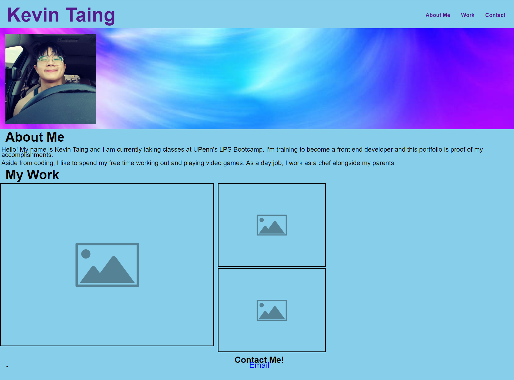

# portfolio

## Description

The purpose of this project was to create a draft for our professional portfolios. We needed to deploy our learned knowledge of using semantic HTML elements as well as flexbox for our stylesheets. In addition, we also used media queries in order to make our portfolios webpage responsive.

## Usage

<ul>
    <li>
        <a href="https://github.com/Soleiles/portfolio">Repository</a>
    </li>
    <li>
        <a href="https://soleiles.github.io/portfolio/">Live Site</a>
    </li>
</ul>

## License

Refer to license in the repository.